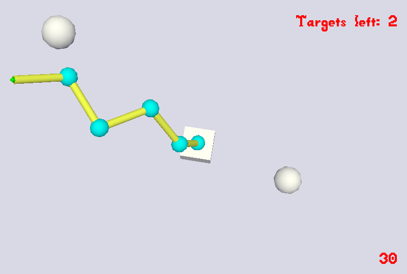

# Robot Arm

Author: Benjamin Huang

Design: This is a game which demonstrates the need for inverse kinematics.

Screen Shot:

How To Play:

Use the keyboard to control the robot arm. There are five pivots on the arm, and each pivot has full rotational freedom. Controls for each pivot come in sets of six keys.
Pivot 1 (closest to base): QW (x-axis) | AS (y-axis) | ZX (z-axis)
Pivot 2: ER | DF | CV 
Pivot 3: TY | GH | BN 
Pivot 4: UI | JK | M,
Pivot 5: OP | L; | ./

The camera views can be changed by using the Left/Right arrow keys.

Sources:

The robot arm created by myself in Blender. Heavy reference to tutorial by Christopher Yonge at https://www.youtube.com/watch?v=5ggUpJh4y6I

This game was built with [NEST](NEST.md).
